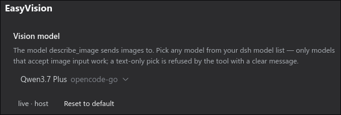

# dsh-easyvision


**Give your text-only agent eyes — with one command and zero extra APIs.**

A [DeepSeek Harness](https://github.com/deepseek-ai/deepseek-harness) (dsh)
plugin that lets a text-only conversation model "see" images by delegating
them to a **vision model from your own dsh model list**, called over the
harness's own LLM runtime.

## Why

Your main model (e.g. `deepseek-v4-flash`) is text-only, so dsh's built-in
`read_image` tool refuses to send image blocks to it. dsh-easyvision fixes
that in two complementary ways:

- **Attached images in the web chat just work.** When you drop an image into
  the composer and send it, the message is admitted and the image is
  described through the vision model — no more "The current model does not
  support images; switch to a model that does" refusal. This happens only
  while the plugin is active, configured, and resolves a vision-capable
  model; if anything is wrong with the plugin you get an actionable
  "configure EasyVision" error instead.
- **`describe_image` tool** — the model can also inspect image *files* on its
  own by calling the tool, which hands the picture to the vision-capable
  model and returns the description as plain text.

No external API keys. No extra plumbing. Just a model that can see, picked
from the models you already have.

## Features

- **One command install** — idempotent, safe to re-run
- **Zero external APIs** — the vision call goes through `ctx.llm`, the exact
  same runtime the agent loop uses: your keys, your retry policy, your middleware
- **Any vision model** — pick anything from your dsh model list in
  Settings → EasyVision; no vendor lock-in
- **Live configuration** — model changes apply immediately, no restart
- **Multiple images per call** — validated PNG/JPEG/WebP/GIF, same
  attachment pipeline as `read_image`
- **Composer image drops** — images attached to a chat message are described
  automatically when the conversation model is text-only

## Screenshots

Configure the vision model in the dsh **Settings** UI — no file editing:



## Quick start

```bash
curl -fsSL https://raw.githubusercontent.com/s3yf1337/dsh-easyvision/main/install.sh | bash
```

That's it. Then open **Settings → EasyVision** and pick a vision-capable
model from your list (the default is `qwen3.7-plus` on `opencode-go`).

> Only models that declare image input work — a text-only pick is refused by
> the tool with a clear message.

## Demo

```text
$ dsh "what's in testpics/1.jpg?"

  ✦ describe_image(file_paths=["testpics/1.jpg"])
  ✓ qwen3.7-plus (opencode-go) · 1024×1024

  A futuristic cityscape at night — glowing cyan and blue towers
  under three moons, rendered in a digital painting style.
```

## How it works

Two entry points, one pipeline:

```
composer: drop an image into the chat  ──▶  host session.prompt admission
                                              │  model text-only?
                                              ▼
                                    easyvision bridge (ctx service)
                                              │  validate + save image
                                              ▼
                         ctx.llm.stream(provider, model, messages=[image blocks + prompt])
                                              │
                                   vision model (e.g. qwen3.7-plus)
                                              │
                         description text ──▶ admitted as the user message

model turn: describe_image(paths, prompt?) ──▶ same vision pipeline, called as a tool
```

The `install.sh` / `scripts/patch-dsh-host.mjs` host patch changes the
`session.prompt` admission: when the conversation model is text-only and the
message carries images, the host asks the plugin's `easyvision` service to
describe them instead of refusing outright. The prompt is admitted **only**
when the service is present (plugin active) and the configured model resolves
and declares `image` input (plugin configured and healthy). Otherwise the
client gets an actionable error naming the fix (see Troubleshooting).

The plugin validates the configured model against your dsh model list and
refuses to run when it is missing or does not declare `image` input — before
any filesystem I/O.

## Configuration

Everything is optional — the defaults work out of the box.

| Control | Meaning |
|---|---|
| **Vision model** (picker) | Any model from your dsh model list, grouped by provider — the same catalog the composer's picker uses. |
| Advanced → Max tokens | Optional output cap for the vision call. |
| Advanced → System prompt | System prompt sent to the vision model before every call. |
| Advanced → Default prompt | Question used when `describe_image` is called without a prompt. |

Profile-level defaults live in the plugin's entry config
(`cordis.patch.yml`) and act as the base layer: Settings overrides inherit
from it, and "Reset to default" restores it.

## Tool

`describe_image(file_paths: string[], prompt?: string)` — sends one or more
image files to the vision model and returns its description, plus the
resolved provider/model, per-image dimensions, and whether the response hit
the token limit.

## Troubleshooting

<details>
<summary>Settings shows "unavailable" for EasyVision</summary>

The harness's API gateway serves only an explicit allowlist of settings
namespaces to the browser, so the plugin cannot extend it through a seam
yet. Run `node scripts/patch-dsh-host.mjs` (one-time, idempotent — re-run
after every dsh upgrade). The tool itself keeps working without it, using
the profile-level defaults.
</details>

<details>
<summary>Attaching an image says the plugin is not active or misconfigured</summary>

Sending an image to a text-only conversation model is admitted only while
the `easyvision` service is active and resolves a vision-capable model. The
error code tells you what to fix:

| Code | Meaning | Fix |
|---|---|---|
| `easyvision-unavailable` | the plugin is not loaded/active in this profile | add it to the profile (`install.sh`, or the `cordis.patch.yml` row) and restart |
| `easyvision-not-configured` | the resolved vision model is not in your dsh model list | open Settings → EasyVision and pick a model from the list |
| `easyvision-model-text-only` | the picked model does not accept images | open Settings → EasyVision and pick a vision-capable model |
| `easyvision-vision-failed` | the vision call itself failed (upstream error shown) | check the model/provider in Settings → EasyVision and its quota |
| `easyvision-image-invalid` | the attached image failed validation | re-attach a valid PNG/JPG/WebP/GIF within the message limits |

A text-only conversation model with a **vision-capable** main model pick
never consults the bridge: image blocks go straight to the model as before.
</details>

<details>
<summary><code>AUTH</code> errors from the vision model</summary>

Model choice matters for quotas. On the opencode.ai Zen GO plan
(requests per 5 h / week / month) good vision-capable options include:
qwen3.7-plus **4 300 / 10 800 / 21 600** (the default), MiniMax M3
3 200 / 8 000 / 16 000, Qwen3.6 Plus 3 300 / 8 200 / 16 300, GPT-5.6 Luna
2 050 / 5 100 / 10 250, Kimi K2.6 1 150 / 2 880 / 5 750.

MiMo-V2.5 has by far the best quota (30 100 / 75 200 / 150 400), but as of
this writing the `opencode.ai` gateway answers **all** `mimo-*` model ids on
some accounts with `403` (AUTH), while other models on the same key work
fine. If `describe_image` fails with `AUTH`, pick another vision-capable
model from your list.
</details>

## Manual installation

<details>
<summary>Wire it by hand (advanced)</summary>

1. Add `"dsh-easyvision": "file:/path/to/dsh-easyvision"` to the profile's
   `package.json` dependencies and link it into the profile's `node_modules`
   (or `dsh plugin --profile NAME add dsh-easyvision`).
2. Load it in the profile's `cordis.patch.yml`:

   ```yaml
   - insert:
       - id: easyvision
         name: 'dsh-easyvision'
         config:
           provider: opencode-go
           model: qwen3.7-plus
   ```

3. Patch the installed host so the Settings page exposes the namespace AND
   `session.prompt` admits images through the bridge:
   `node scripts/patch-dsh-host.mjs` (one-time; re-run after dsh upgrades).
4. Restart the harness. The model must be present in your dsh model list
   (`~/.dsh/settings.yaml` or Settings → Models) and the provider must
   actually serve it.

Install script options: `--profile NAME` (default `desktop`), `--link`
(symlink a dev checkout), `--no-restart`.
</details>

## Development

```bash
# headless smoke test (plugin must be installed in the headless profile)
dsh --profile headless "Use describe_image on testpics/1.jpg and report what it returns"
```

## License

MIT
